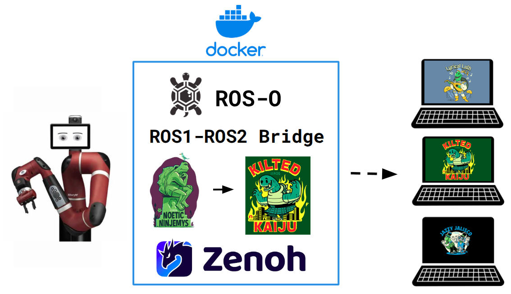

# Sawyer Bridge




ROS 1 Noetic hit end-of-life in May 2025. If you have a Sawyer sitting in your lab on the old ROS 1 stack, this bridge gets you to ROS 2 in under 10 minutes without any changes to the robot required.

It runs a Docker container on your laptop that bridges all of Sawyer's ROS 1 topics and services to ROS 2 using [`ros1_bridge`](https://github.com/RethoughtRobotics/ros1_bridge) over Zenoh. For a deep dive into how it works, see [Architecture](ARCHITECTURE.md).

Looking for Baxter? Checkout the same project for Baxter [baxter-zenoh](https://github.com/RethoughtRobotics/baxter-zenoh)

---

## Prerequisites

- Ubuntu 24.04
- ROS 2 Jazzy, Kilted, or Lyrical installed and sourced (`source /opt/ros/<distro>/setup.bash`)
- Docker
- NetworkManager (`nmcli`) — standard on Ubuntu Desktop

---

### Clone the repo

```bash
git clone https://github.com/RethoughtRobotics/sawyer-zenoh.git
cd sawyer-zenoh
```

---

## 1. One-time setup

Run once on any machine you want to use with Sawyer:

```bash
bash setup.sh
source ~/.bashrc   # or ~/.zshrc if you use zsh
```

This installs the Ethernet profile, Zenoh middleware, and adds `sawyer_start` / `sawyer_msgs` aliases to your shell.

Then pull the Docker image and build the ROS 2 message definitions:

> **Note:** The image is about 10 GB - pulling takes roughly 3 minutes on a good connection.

```bash
docker pull ghcr.io/rethoughtrobotics/sawyer-zenoh:latest
cd ~/sawyer-zenoh/ros2_msgs && colcon build
```

Then restart the ROS daemon (required due to a [known Zenoh issue](https://github.com/ros2/rmw_zenoh/issues/184)):

```bash
sudo pkill -9 -f ros && ros2 daemon stop && ros2 daemon start
```

---

## 2. Each session

Make sure the robot is on and the Ethernet cable is connected, then open two terminals:

| Terminal 1: Bridge | Terminal 2: Your ROS 2 workspace|
|---|---|
| `sawyer_start` | `sawyer_msgs` |

**Terminal 1** runs the bridge and stays open. **Terminal 2** (and any others you open) run `sawyer_msgs` once to source the compiled sawyer_msgs.

---

## 3. Controlling the robot

**Verify the bridge is working**
```bash
ros2 topic echo /robot/joint_states
```
**Enable the robot**
```bash
ros2 topic pub --once /robot/set_super_enable std_msgs/msg/Bool "{data: true}"
```
**Disable the robot**
```bash
ros2 topic pub --once /robot/set_super_enable std_msgs/msg/Bool "{data: false}"
```

---

## 4. Next steps

Once the bridge is running, use the Sawyer SDK for higher-level control — motion planning, gripper control, joint commands, and building your own ROS 2 applications:

<a href="https://github.com/RethoughtRobotics/SawyerSDK">
  
</a>

---

## FAQ

<details>
<summary><b>The bridge starts but I see no topics on the ROS 2 side</b></summary>

Make sure you have run `sawyer_msgs` in your terminal. Without it, `RMW_IMPLEMENTATION` and the Sawyer message definitions are not set.

```bash
sawyer_msgs
ros2 topic list
```

If topics are still missing, check that `ROS_DOMAIN_ID` is unset:

```bash
unset ROS_DOMAIN_ID
ros2 topic list
```

</details>

<details>
<summary><b>The bridge exits immediately after starting</b></summary>

The bridge waits for the ROS 1 master before starting. Make sure the robot is on, the Ethernet link is up, and `10.42.0.2` is reachable:

```bash
nmcli connection up Rethink
ping -c1 10.42.0.2
```

</details>

<details>
<summary><b><code>nmcli connection up Rethink</code> says the connection is unknown</b></summary>

The Rethink Ethernet profile has not been installed on this machine. Run the one-time setup:

```bash
bash setup.sh
```

</details>

<details>
<summary><b>I see ROS 2 topics but the robot does not enable</b></summary>

Check the e-stop status. If the e-stop is engaged, the robot will not enable.

```bash
ros2 topic echo --once /robot/state
```

If `estop_button` and `estop_source` are `1`, the e-stop is engaged. Disengage it and reset the robot:

```bash
ros2 topic pub --once /robot/set_super_reset std_msgs/msg/Empty
```

</details>
